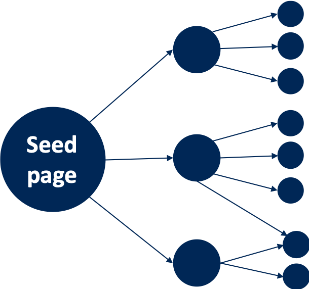

# Web-crawler_wikipedia
Python codes to crawl Wikipedia articles in the network format

***

Description
-----------
This code 1)takes the title of seed Wikipedia page; 2)crawls the Wikipedia articles linked with the seed page; and 
3)generates the network with the collected page

The following figure shows the architecture of the network.

  1. Example of the output ("Ajax(Programming language)" as the seed page) is presented
  2. The network drawn with the Gephi is also presented

Prerequisites
-------------
1. Python (the codes in this repository are developed using Python verison 3.6.6)
2. You need several external packages, and they are mentioned in the python file.

